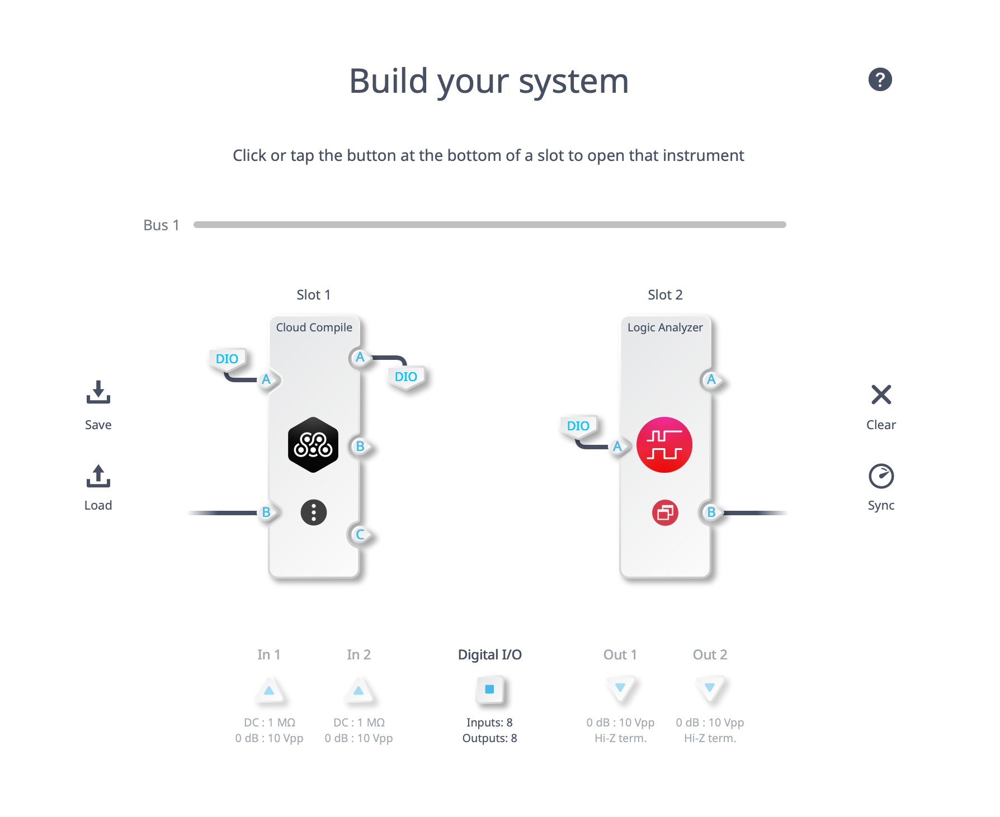
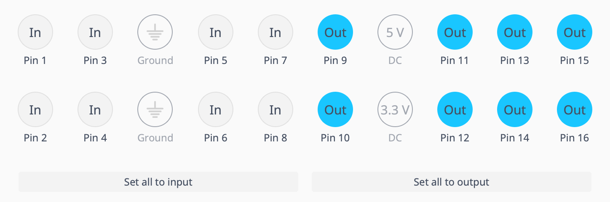
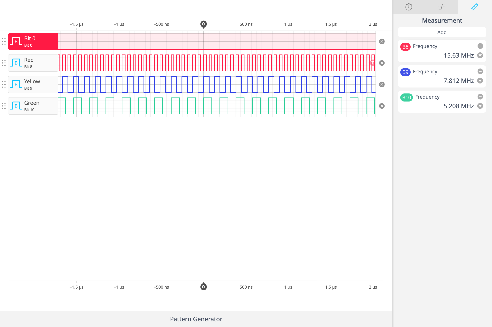
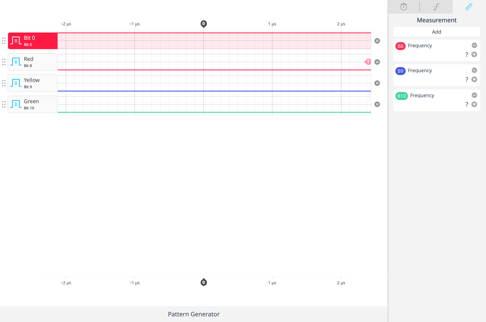

# Clock Divider

**Intended Platform** - Moku:Go with no changes required.  

 
**_NOTE_**: This example could be adapted for the Moku:Pro or Moku:Lab, but would need to output the pulse to an available DAC instead of the DIO port.

## Multi-instrument Mode Configuration

The following configuration will allow you to test the functionality of your MCC design.  The logic analyzer is not required for proper functionality of the MCC design.
### Instrument slots and port mapping

### DIO Configuration

### Signals and Settings
| Port | Slot | Use |
| --- | --- | --- |
| Input A  | Slot 1 (MCC) | Reset on DIO pin 0 |
| Output A | Slot 1 (MCC) | Divided Clock Pulse on DIO pin 8 |
| Input A  | Slot 2 (Logic Analyzer) | DIO |

## Expected Results

The following screenshots show the expected results when the Moku:Go is configured as indicated above.  With Bits 0, 8, 9, and 10 displayed with the logic analyzer
### Clock divider under nominal conditions
The following results match expectations for the Moku:Go.  With an internal clock rate of 31.25 MHz, we expect the singularly divided pulse (bit 8) to be 15.625 MHz (rounded to 15.63 MHz).  Further divisions of the pulse (bits 9 and 10), also match expectations.  

### Clock divider under reset conditions

Setting the reset to true, causes the outputs on bits 8,9, and 10 to be forced to 0.

