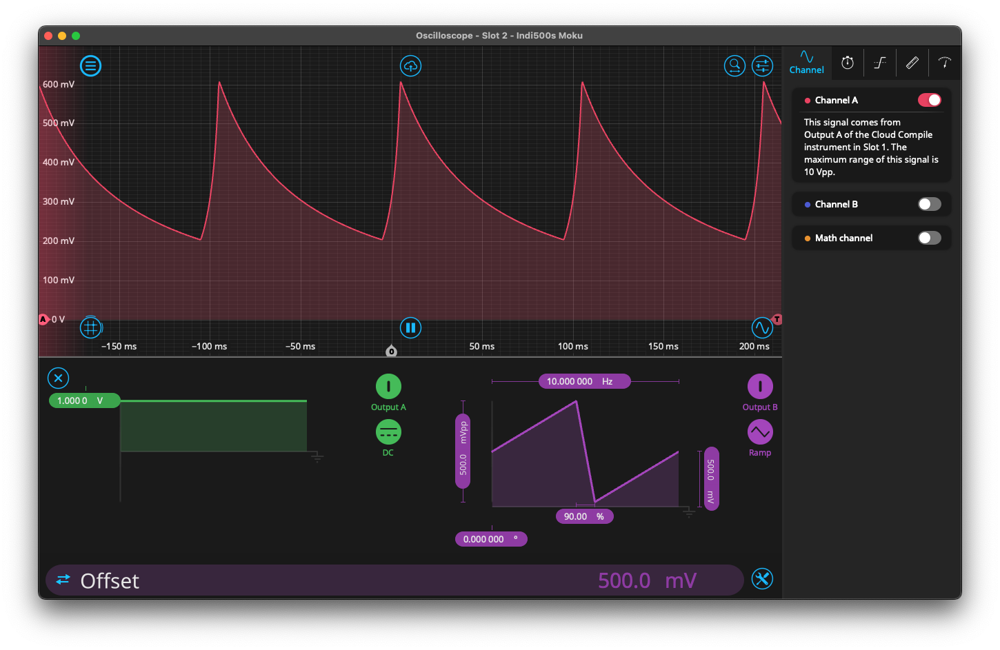

# Input Divider

This is the implimentation of OutputA = Control0 * (InputA / InputB).

Control register 0 "Control0" must be set to 1 so the OutputA product is not 0. Control0 is a scalar of the Divider output, e.g. if Control0 = 2, the signal is scaled to 2x the original output. The output signal may have to be scaled significantly (Control0 > 100) to get a legible signal. For example in the screenshot below, Control0 was set to 6000 to get an output in the mV range.

The quotient signal can be routed to the Moku Oscilloscope in the contiguous Slot for quick viewing of the signal and to check the signal is as expected;

This Divider code was written with [Mathworks's HDL Coder](https://www.mathworks.com/products/hdl-coder.html).
