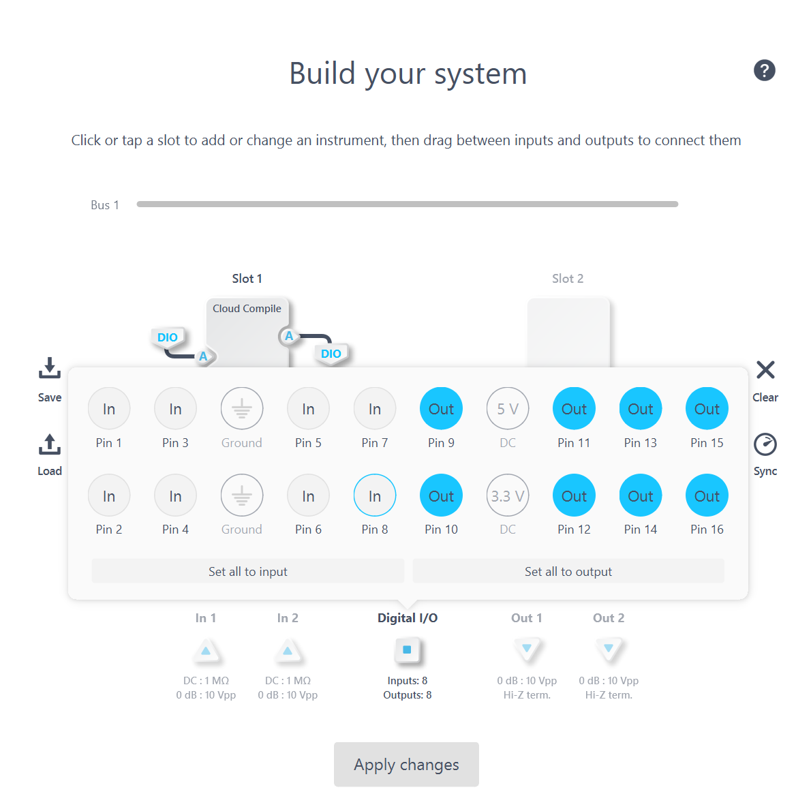

# DIO example

This example demonstrates how to use Cloud Compile with the Digital In/Out pins to perform basic logical operations

## Getting Started

### Signals and Settings
| Port | Use |
| --- | --- |
| Input A  |	DIO |
| Output A | 	DIO |
| Pin 1-8 | 	Input |
| Pin 9-16 | 	Output |

### Build your system

