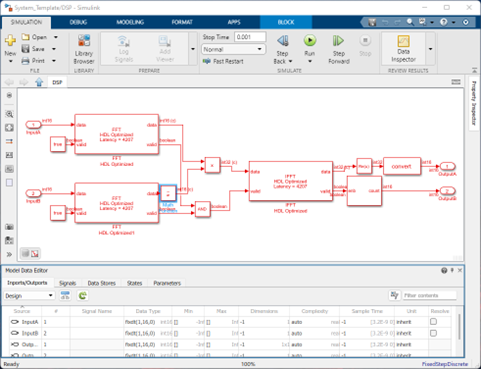

# Simulink™ Cross-Correlator

Cross-correlation is a very common algorithm that is used to perform time delay analysis between two signals. This operation can be efficiently performed on an FPGA chip in the frequency domain. First, the input signals are converted from the time domain to the frequency domain via fast Fourier transform. Next, the complex conjugate is taken from one of the spectra. Then, the product of the two signals in the frequency domain is sent to an inverse Fourier transform to generate the cross-correlation result.

## Overview
This model generates the cross-correlation results on OutputA, and the corresponding time delays on OutputB. The cross-correlogram can be visualized on an oscilloscope with the X-Y mode.

## Getting Started

### Signals and Settings

| Port | Use |
| --- | --- |
| Input A  |	Signal 1 |
| Input B  |	Signal 2 |
| Output A | 	Cross Correlation |
| Output B | 	Time Delay |

### Results

